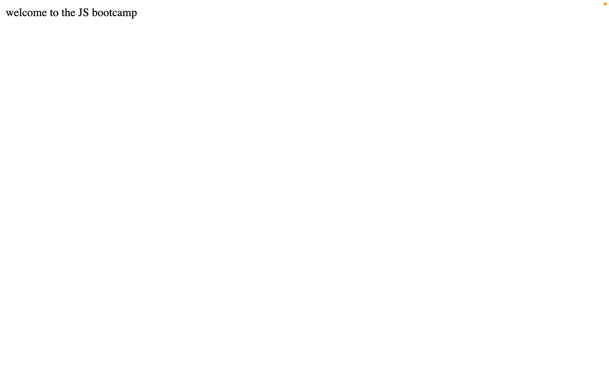
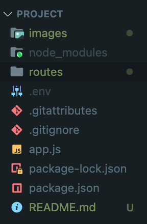

This is the project of Tuwaiq Bootcamp

# **My Project**

<h1>Hello world</h1>

## /Hello Route:



---

## Project Structure (With Routes)



_The app is listening to the port 8000_

```javascript
// step: 3
app.listen(8000, function () {
	console.log("listening");
});
```

<code>
// step: 3
app.listen(8000, function () {
	console.log("listening");
});
</code>
